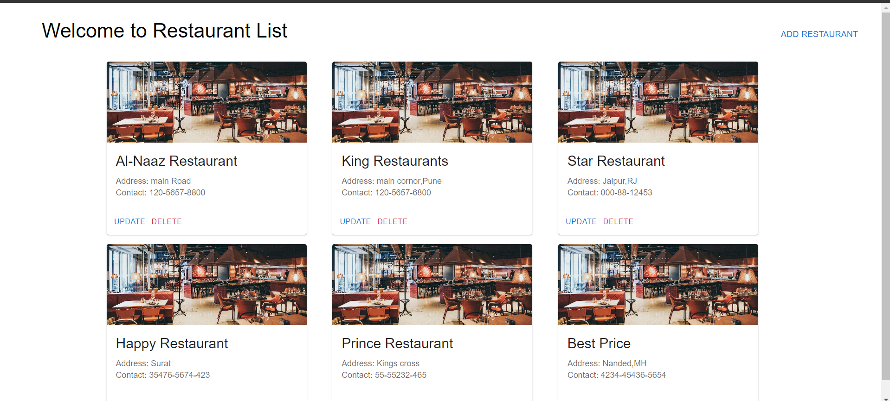
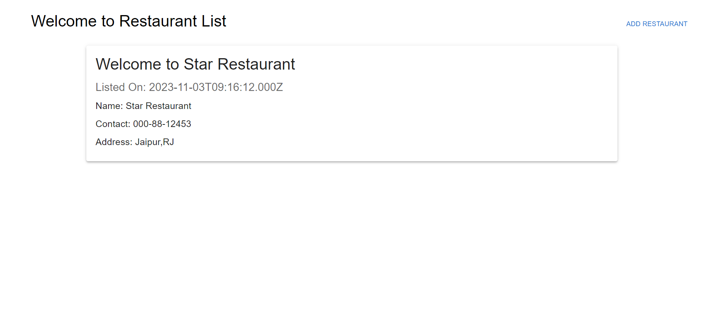
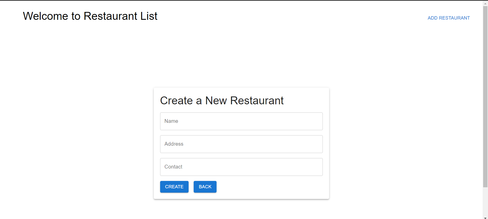
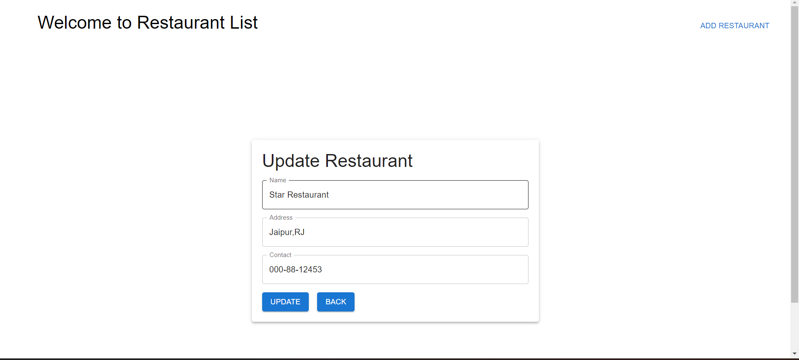

<!-- # Restaurant-Listing-Platform

A Restaurant Listing Platform Full stack app with React.js, Node.js, Express.js MySQL Database


## Screenshots




 -->

# Restaurant Listing Platform

A full-stack web application for listing and managing restaurants, built with React.js, Node.js, Express.js, and MySQL database.

## Screenshots


## Tech Stack

- **Frontend**:

  - React.js
  - Material-UI
  - React Router (for routing)
  - React hot toast

- **Backend**:

  - Node.js
  - Express.js (Node.js web application framework)
  - Sequelize (ORM for interacting with MySQL)

- **Database**:
  - MySQL (Relational Database Management System)

## Features

- **Restaurant Listing**: Display a list of restaurants with their names, addresses, and contact information on the frontend.

- **Add New Restaurants**: Provide a form on the frontend to allow users to add new restaurants to the platform. The added restaurants are stored in the database.

- **Update Restaurants**: Implement functionality to update existing restaurants' information (name, address, contact) on the frontend and save the changes to the database.

- **Delete Restaurants**: Allow users to delete restaurants from the platform, removing them from the database.

## How to Run

1. Clone this repository to your local machine.

2. Navigate to the "server" directory and run the following commands to set up the server:

```

npm install
node index.js

```

3. Open a new terminal, navigate to the "view" directory, and run the following commands to set up the client:

```
cd view
npm install
npm run dev
```

4. The application should be accessible in your web browser at `http://localhost:5173`.

## Contributing

If you would like to contribute to this project, feel free to open issues, create pull requests, or provide suggestions.

## License

This project is licensed under the [MIT License](LICENSE).

---

Happy coding!
